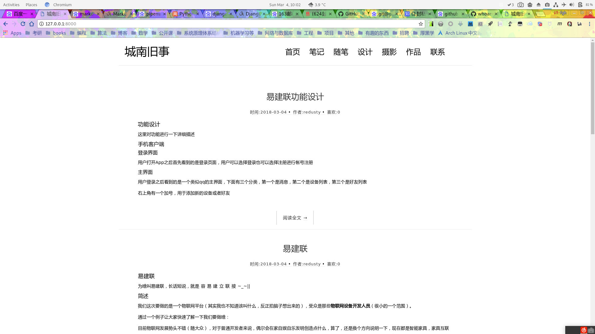
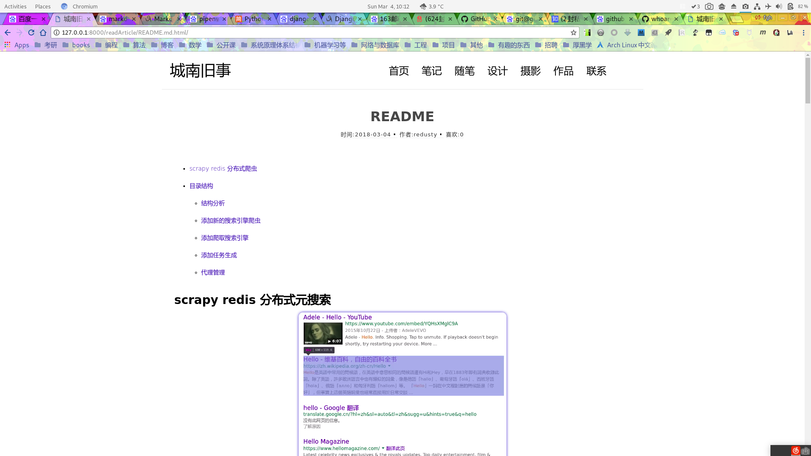
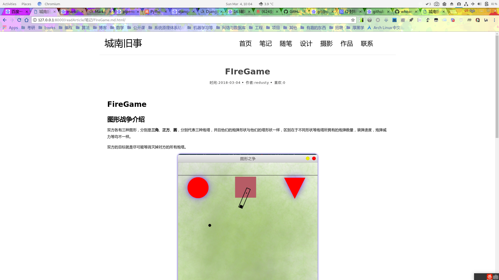

# 极简主义Markdown Blog

## 说明

极简主义markdown blog是一个以markdown文件为基础的使用django编写的个人博客系统。

一个极简主义的markdown博客：[城南旧事](http://www.chengnanjiushi.site)

## 功能

将markdown文件放置到指定目录下即可，后台会自动进行分析，然后生成markdown解析文件，我们浏览网页时即可浏览到解析之后的所有文章。

### 配置Markdown Blog

打开代码中的```config.py```文件进行配置，相关信息阐述如下：

1. ROOT_DIR: 文章的根目录
2. DEFAULT_ENTRY_NUM: 每页显示文章条目数量
3. SORT_BY: 默认文章的排序方式
4. IGNORE_PREFIX: 忽略前缀
5. IGNORE_DIR: 忽略文件夹
6. IGNORE_FILE: 忽略文件
7. FILE_TYPE: 文章类型百名单
8. THEME: 主题选择，默认提供三种主题
9. TOP_BAR: 顶栏
10. ARTICLE_DEFAULT: 文章缩略配置
11. EMAIL: 配置邮箱

### 主题编写

前端开发人员可以使用django提供等templete来进行前端主题的开发，MarkdownBlog已经预留了所有与前端templete交互等接口。

### 部署

本代码使用pipenv，首先下载pipenv，然后进入代码中运行```pipenv install```安装所需的依赖（不需要root）。

之后运行```pipenv shell```进入虚拟环境，然后运行```python manage.py runserver 0.0.0.0:8000```即可在本地访问到  [Markdown Blog][1]

[1]: http://localhost:8000 "Markdown Blog"


## 展示

黑白主题








## 后期功能

- 添加vim支持，在vim中进行文档编辑，然后可以与服务器同步